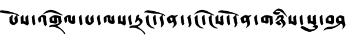

# Transductive Learning for Reading Handwritten Tibetan Manuscripts

This software implements trunsductive learning for unsupervised handwritten character recognition. 
It includes:
- A projective based unsupervised line segmentation algorithm
- Synthetic text generation and data augmentation for HCR training
- CRNN implementation for HCR
- Implementation of three method for transductive learning for HCR: CycleGan, DANN and VAT 

The repository also includes a new test set containing 167 transcribed images of \emph{bKa’ gdams gsung ’bum} collection. \
The software was tested on this collection and shows promising results.


## Prerequisites

The software has only been tested on Ubuntu 16.04 (x64). CUDA-enabled GPUs are required. 
Tested with Cuda 8.0 and Cudnn 7.0.5

## Installation

### Install text rendering software
1. Install Tibetan fonts:
```console
mkdir ~/.fonts
cp extra/Fonts/* ~/.fonts
sudo fc-cache -fv
``` 
2. Change language settings to allow ASCII text reading:
```console
sudo update-locale LANG=en_US.UTF-8
```
3. Install pre-requisits
```console
sudo apt-get install cairo-dock
sudo apt-get install pango1.0-tests
sudo apt-get install gtk2.0
sudo add-apt-repository ppa:glasen/freetype2
sudo apt update && sudo apt install freetype2-demos
``` 
4. Compile cpp text rendering program:
```console
cd extra/TextRender/c_code
make
cd ../bin
chmod u+x main
```
5. Check that both installation and compilation worked correctly:
- to test font installation run:
```console
bin/main_show_fonts | grep Shangshung
bin/main_show_fonts | grep Qomolangma
```
You should see these four font families:
   - Shangshung Sgoba-KhraChung
   - Shangshung Sgoba-KhraChen
   - Qomolangma-Betsu
   - Qomolangma-Betsu
- to test compilation run:
```console
bash test.sh
```

### Create python evironment and install dependencies
```console
cd <base project dir>
conda create -n tibetan_hcr python=3.6
source activate tibetan_hcr
pip install -r requirements.txt
cd Src/utils/warp-ctc
mkdir build; cd build
cmake ..
make
cd ../pytorch_binding
python setup.py install
cd ../..
export CFLAGS='-Wall -Wextra -std=c99 -I/usr/local/cuda-8.0/include'
git clone --recursive https://github.com/parlance/ctcdecode.git
cd ctcdecode
pip install .

```

The following image should be created in *Src/data/extra/TextRender/test*:


## Data Preperation 
There are three parts to data preparation:
1. Using unsupervised line segmentation to separate test images to lines
2. Rerdering synthetic multi line images and separating lines using line segmentation
3. Creating a character lexicon from both training and testing datasets.
We provide two ways to get data fom training and testing:
1. downloding prepared data
2. Instructions and code to prepare data
### Downloading Prepared Validation and Syntesized Train Data
1. Get prepared synthetic data:
    - Download Prepared Data ([google drive link](https://drive.google.com/file/d/1Z_ar_ogYmCN_VFKGsav5nP12AN1_Dn3P/view?usp=sharing))
to *Data/Synthetic*
    - untar file:
    ```console
    tar -xzvf synth_prepared.tar.gz
    ```
2. Get prepared test data-set:
    - Download Prepared Data ([google drive link](https://drive.google.com/file/d/15fR99vzupHpkTNNs2aEx9jCZYSyQnKK4/view?usp=sharing)
    to *Data/Test*
    - untar file:
    ```console
    tar -xzvf test_prepared.tar.gz
    ```
3. Get prepared character lexicon:
- Download character lexicon file ([google drive link](https://drive.google.com/file/d/1TFdYqYYEdpREfcQGfgECMm37czU8wqBw/view?usp=sharing)
    to *Data*
### Preparing Test and Train data
1. Segment test images to lines & create dataset file:
    - Download test images ([google drive link](https://drive.google.com/file/d/1ndn7uquU25J97_DK-V9FuMNN2AL65s1y/view?usp=sharing)))
    to *Data/Test*
    - Untar file:
    ```console
    tar -xzvf test_original.tar.gz
    ```
    - Segment images to line and create a dataset file containing line image to text tuples:
    ```console
    cd Src/data_preperation
    python 1_prepare_orig_images.py
    ```
2. Create synthetic images and dataset file:
    - Download texts to synthesize train images ([google drive link](https://drive.google.com/file/d/1igUXljiJcDK7OUM7IQB5iHXC0Az63-o3/view?usp=sharing))
    to *Data/Synthetic*
    - Create synthetic images and a dataset file containing line image to text tuples:
    ```console
    cd Src/data_preperation
    python 2_prepare_synth_images.py
    ```
3. Create character lexicon for both synthetic and original data:
```console
cd Src/data_preperation
python 3_create_class_dict.py
```    
## Training 
Now that you have the dataset prepared and all the prerequisits installed, you can run CRNN trainig and testing.
To do so go to _base_project_dir/Src_.
### Training Options
- Transductive VAT
```console
python train.py --do-test-vat True --vat-epsilon 0.5 --vat-xi 1e-6 --vat-sign True --vat-ratio 10. \
--output-dir '../Output/transductive_vat' --do-lr-step True
```
- Transductive Adversarial Domain Adaptation
```console
python train.py --do-ada-lr --ada-after-rnn True --ada-before-rnn True --rnn-hidden-size 256 --do-ada-lr True \
--do-ema True --do-beam-search True --ada-ratio 10. --output-dir '../Output/dann_cnn_rnn' 
```
- Network consensus self-supervision
```console
python train_multinet.py --max-iter 60000 --do-test-ensemble True --test-ensemble-ratio 10. \
--test-ensemble-thresh 2. --output-dir '../Output/multinet_self_supervision' 
```
#### Training CycleGAN on Tibetan Data
To train CycleGAN on tibetan data do the following:
- run the following from console
```console
mkdir (base_dir)/CycleData
cd (base_dir)/Src/CycleGan
conda create -n cycle_tibetan python=3.5
source activate cycle_tibetan
pip install -r requirements.txt
python train.py --dataroot /media/data2/sivankeret/cycle_tibetan --name tibetan_cycle_identity_2 --model cycle_gan --no_dropout --resize_or_crop resize_and_crop --fineSize 64 --loadSize 98 --lambda_identity 2 --checkpoints_dir /media/data2/sivankeret/Runs/cycle_gan
```
- split synthetic train data to 90% train and 10% validataion images and put the in directories 
_(base_dir)/CycleData/trainA_ and _(base_dir)/CycleData/valA_ accordingly.
- split original data to 90% train and 10% validataion images and put the in directories 
_(base_dir)/CycleData/trainB_ and _(base_dir)/CycleData/valB_ accordingly.
- Train CycleGan by running the following line from _(base_dir)/Src/CycleGan_:
```console
python train.py --dataroot ../../CycleData --name TibetanCycle --model cycle_gan --no_dropout --resize_or_crop resize_and_crop --fineSize 64 --loadSize 98 --lambda_identity 2 --checkpoints_dir ../../CycleModel
```
- To infer CycleGan on synthetic data do:
```console
python test.py --dataroot ../../CycleData \
--name TibetanCycle --model cycle_gan --phase test --no_dropout \
--which_epoch 50000 --results_dir ../../CycleResults/Synth \
--checkpoints_dir ../../CycleModel \
--resize_or_crop only_resize \
--loadSize 64 --how_many 600000 --show_by B --only_one
```
Now you can use synthetic data mapped by CycleGan for training.
- To infer CycleGan on test data do:
```console
python test.py --dataroot ../../CycleData \
--name TibetanCycle --model cycle_gan --phase test --no_dropout \
--which_epoch 50000 --results_dir ../../CycleResults/Orig \
--checkpoints_dir ../../CycleModel \
--resize_or_crop only_resize \
--loadSize 64 --how_many 600000 --which_direction B2A --only_one
```
Now you can infer CRNN on test data after CycleGan mapping.
Notice that CycleGAN implementation in this directory is a copy of the following directory with slight changes:
[pytorch cycle gan](https://github.com/junyanz/pytorch-CycleGAN-and-pix2pix)
The changes are programmatic changes to allow for easier text inference.
## Testing
### Downloading Pretrained Models
If you would like to run tests on pretrained models, you can download the following models:
- CRNN model trained using transductivate vat [google drive link](https://drive.google.com/open?id=1dHZFKdpo4Bb34waDtPGhJrwBnvQPamR8)
- CRNN model trained using adversarial domain adaptation [google drive link](https://drive.google.com/file/d/1gE10RHpHVRMcKMA95lV772xcVDCVN_vC/view?usp=sharing)
Please download the models to the directory: (cur_project)/PreTrainedModels (you should first create the directory).
### Downloading Test Dataset Images After CycleGAN Mapping
To run model on images of test data after mapping by cycle GAN you can download the transformed data from:
[google drive link](https://drive.google.com/file/d/1N3_CyBKe0jM2StbtX9-fLJDiAXzns4u5/view?usp=sharing)
### Running Test
To run test on a pretrained single network model, simply run:
```console
cd (base project dir)/Src
python test.py --snapshot (path to snapshot file) --data-path (path to dataset file) --base-data-dir (path to images dir)
```
To run test on a pretrained multi network model, run:
```console
cd (base project dir)/Src
python test_multinet.py --snapshot (path to snapshot file) --data-path (path to dataset file) --base-data-dir (path to images dir)
```
## License
This project is licensed under the MIT License - see the [LICENSE.md](LICENSE.md) file for details. \
Please cite the following paper if you are using the code/model in your research paper:
"Transductive Learning for Reading Handwritten Tibetan Manuscripts"

